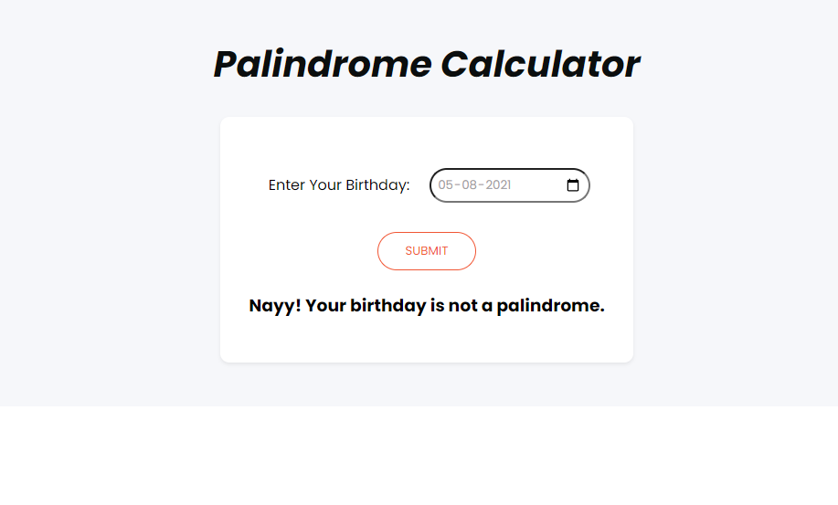

<h1>Palindrome Birthday</h1>

This app can check if their birthday is a palindrome date.
Palindromes are the strings or numbers which are same if reversed.

> This project is part of neog.camp. It is mark 11 <b>Palindrome Birthday</b>.
> 
